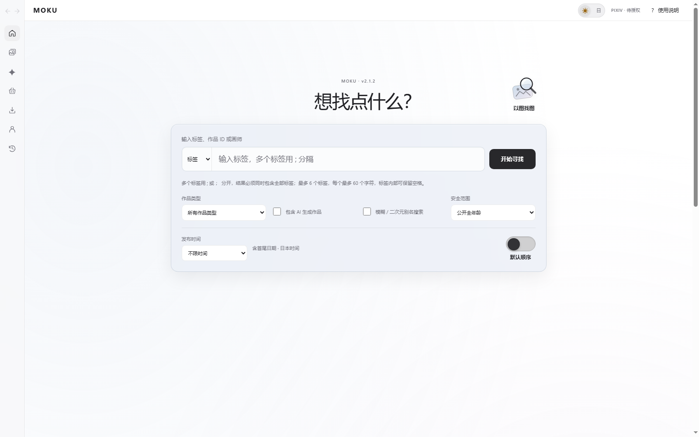
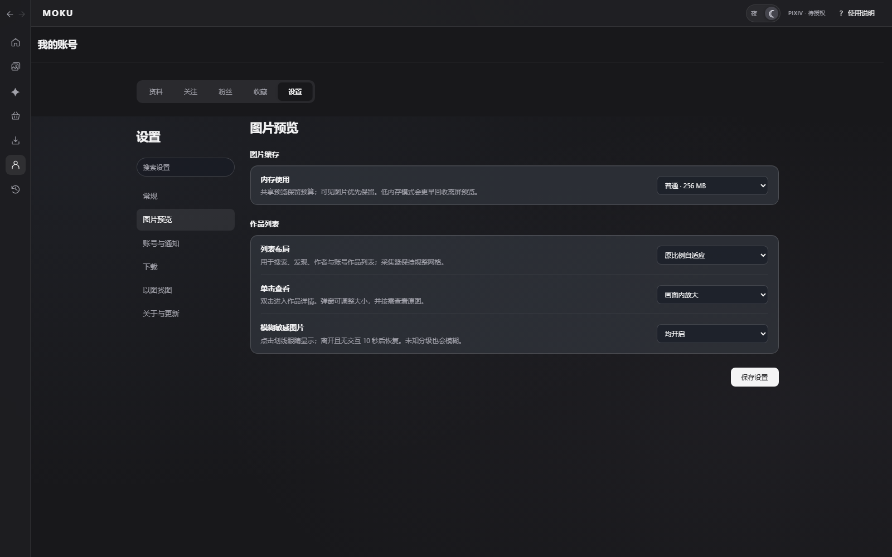
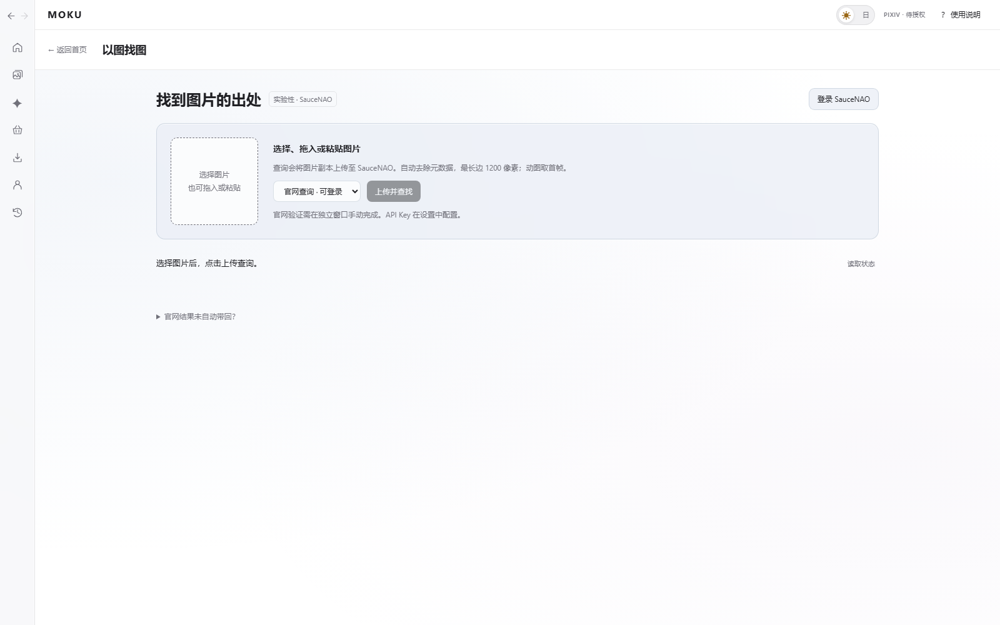

<p align="center">
  
</p>

<h1 align="center">MOKU</h1>

<p align="center">Windows 上的 Pixiv 浏览、云收藏与下载管理工具</p>

<p align="center">
  <a href="https://github.com/Xirti/Pixiv-Bulk-Image-Downloader/releases/latest"></a>
  <a href="https://github.com/Xirti/Pixiv-Bulk-Image-Downloader/releases"></a>
  <a href="LICENSE"></a>
  <a href="https://github.com/Xirti/Pixiv-Bulk-Image-Downloader/releases/latest"></a>
</p>

<p align="center">
  <a href="https://github.com/Xirti/Pixiv-Bulk-Image-Downloader/releases/latest">下载最新版</a> ·
  <a href="#开始使用">开始使用</a> ·
  <a href="RELEASE_NOTES.md">更新日志</a> ·
  <a href="#常见问题">常见问题</a> ·
  <a href="https://github.com/Xirti/Pixiv-Bulk-Image-Downloader/issues">反馈问题</a>
</p>

从标签、画师或一张图片出发，浏览推荐与榜单，整理云端收藏，把喜欢的作品保存到电脑。

<p align="center">
  
</p>

## 功能

| 功能 | 说明 |
| --- | --- |
| **搜索与画师** | 多标签、作者名、UID 和作品 ID 搜索，支持作品类型、AI、日期与内容范围筛选。同名作者提供候选，作者主页汇集资料和作品。 |
| **发现作品** | 推荐、综合日榜／周榜／月榜、新人榜、原创榜与关注新作。页面记住排序偏好，支持手动开始、中断和重新加载。 |
| **浏览与预览** | 原比例自适应和规整网格两种布局，单击展开或弹窗预览，双击查看详情。多图逐页切换，动图悬停播放，原图按需加载。 |
| **云端收藏与关注** | App 授权和网页登录可选，支持公开／私密收藏与关注、收藏标签编辑、自动同步和手动同步。 |
| **以图找图** | 接入 SauceNAO，展示匹配来源、相似度和站点链接，Pixiv 结果可直接进入作品详情。支持个人 API Key 与官网查询。 |
| **下载与管理** | 采集篮逐张选图，批量下载、文件去重、暂停恢复、下载历史与活动热力图。动图支持 ZIP + JSON、GIF 和 MP4。 |
| **桌面体验** | 日夜主题、磨砂界面、前进／后退与鼠标侧键，提供图片缓存、请求节奏和后台更新设置。 |

收藏数排序支持标签搜索候选池（最多 500 件）、作者全部可见作品、当前推荐池和榜单。内容范围包括全年龄、R-18、R-18G 及全部可见作品，跟随 Pixiv 账号权限。

## 界面

| 日夜主题与设置 | 以图找图 |
| --- | --- |
|  |  |

## 开始使用

运行环境为 **Windows 10/11 x64**，需要 Microsoft Edge WebView2 Runtime 和可访问 Pixiv 的网络。

1. 在发布页选择 Windows x64 安装版或便携版。[下载最新版](https://github.com/Xirti/Pixiv-Bulk-Image-Downloader/releases/latest)
2. 安装后启动 MOKU，或完整解压便携包后运行 `MOKU/MOKU.exe`。
3. 打开「我的账号 → 资料」，选择 App 授权或网页登录，按提示完成 Pixiv 登录。
4. 搜索或进入「发现」，查看作品，将需要下载的图片加入采集篮。
5. 选择保存位置、清晰度、格式和文件夹设置，开始下载。

右上角「帮助」提供常用操作和网络诊断。「我的账号 → 设置 → 关于与更新」可检查新版本。升级保留配置与个人数据。

App 授权在系统浏览器中完成，网页登录在 MOKU 的官方登录窗口中完成。选择网页登录后，MOKU 会向 Pixiv 确认会话身份。恢复保存的会话时，会在首次联网读取前完成确认。

### 搜索方式

| 输入 | 用途 |
| --- | --- |
| `猫耳` | 标签搜索 |
| `猫耳;初音ミク` | 同时匹配多个标签 |
| `pid:123456` | 查找作品 |
| `uid:123456` | 打开作者主页 |
| `author:画师名` | 搜索作者 |

多标签以 `;` 或 `；` 分隔，最多 6 个，每个最多 60 字符。日期筛选按日本时间计算，包含起止当天。

### 常用操作

- **查看作品** — 点击预览，双击打开详情。用方向键翻图，按 Esc 关闭。
- **整理作品** — 左上角勾选框加入采集篮，❤ 管理收藏，作者名旁的＋／√管理关注。
- **继续浏览** — 点击作者或标签跳转，返回时恢复页面位置和已加载预览，空白处右键刷新。
- **同步账号** — 资料页可手动同步，设置可调整自动同步间隔、收藏与关注的默认公开范围。
- **调整内容显示** — 网页登录后，在「设置 → 账号与通知 → Pixiv 浏览设置」调整 R-18／R-18G、敏感作品和 AI 作品显示，修改自动保存到 Pixiv。
- **文件命名** — 在「设置 → 下载」选择默认预设，或按顺序点选自定义字段。多页作品保留原始页序，动图用 `ugoira`，扩展名随下载格式添加。
- **导出动图** — MP4 导出需要支持 `libx264` 的 FFmpeg，将其加入 `PATH` 后启动 MOKU。

## v2.2.4

- 可在下载设置里自定义文件命名、默认预设和下拉项。
- 日间、夜间和跟随系统主题都可保存。
- 修复账号和搜图多窗口状态、关注和收藏翻页、工作区恢复及更新交接中的问题。

完整记录见 [更新日志](RELEASE_NOTES.md)。

## 常见问题

### 官网能看到作品，MOKU 里没有

先确认使用相同的 Pixiv 账号，并检查作品类型、日期、AI 和内容范围。查看收藏时，还需选择对应的公开或私人范围，再刷新列表。

作者页按作品显示卡片，一件多页作品可包含多张图片。作者设置的公开范围和 Pixiv 账号的浏览设置会影响可见内容。

仍有差异时，在问题反馈中附上作品链接、MOKU 版本、登录方式、所在页面和筛选条件。

### 网页登录显示待确认或要求重新登录

恢复保存的网页登录后，首次联网读取会确认会话。确认需要可访问 Pixiv 的网络。若提示会话失效，请在 MOKU 的登录管理中重新登录。

网络超时、官网验证和作品权限不足会分别提示。网络诊断位于「使用说明 → 网络诊断」。

### 动图无法导出为 MP4

安装支持 `libx264` 的 FFmpeg，将其加入 `PATH` 后重新启动 MOKU。ZIP 帧包与 GIF 导出可直接使用。

## 从源码运行

准备 Python 3.12 和 WebView2 Runtime，在 PowerShell 中运行。

```powershell
git clone https://github.com/Xirti/Pixiv-Bulk-Image-Downloader.git
cd Pixiv-Bulk-Image-Downloader
python -m venv .venv
.\.venv\Scripts\Activate.ps1
python -m pip install -r requirements.lock
python moku_app.py
```

### 构建便携版

安装 Node.js 后，在同一虚拟环境中执行。

```powershell
python -m pip install -r requirements-build.lock
powershell -ExecutionPolicy Bypass -File .\make-release.ps1 -Development
```

构建结果位于 `dist/MOKU/`，开发便携包位于 `release/development-v版本号/`。正式发行的签名与构建流程见 [发布签名说明](RELEASE_SIGNING.md)。

### 构建安装版

安装 Inno Setup 7，在构建虚拟环境中执行。

```powershell
.\build-installer.ps1 -Development -Compiler 'C:\Program Files\Inno Setup 7\ISCC.exe'
```

安装程序位于 `release/installer-development-v版本号/`。正式构建省略 `-Development`，通过 `-ReleaseKey` 指定发布密钥，并以 `-VerificationRecord` 提供当前源码的工程验证记录。`-SkipBuild` 复用已校验的 `dist/MOKU/`，`-WebViewInstaller` 可附带微软签名的 WebView2 安装程序。

安装版默认安装到当前用户目录，配置与缓存沿用 `%LOCALAPPDATA%\MOKU`。卸载时可选择清除共用的本机配置、登录状态、缓存和下载历史，默认保留。下载作品文件单独保留。程序内更新继续使用已签名的 ZIP 更新包。

## 反馈与支持

通过 GitHub Issues 提交问题和建议，附上版本号、复现步骤和完整报错文字。界面问题可附截图，作品相关问题请提供作品链接。公开反馈前遮住个人信息。[提交反馈](https://github.com/Xirti/Pixiv-Bulk-Image-Downloader/issues)

请勿提交密码、Cookie、登录令牌或账号数据库。

喜欢一件作品，也请通过详情页的官网链接为画师点赞、收藏或评论，让支持回到创作者身边。

## 许可证与归属

由 **Xirti / Aperia** 开发与维护，项目主页为 [Xirti/Pixiv-Bulk-Image-Downloader](https://github.com/Xirti/Pixiv-Bulk-Image-Downloader)。

源码采用 [MIT License](LICENSE)，允许使用、修改和再分发，分发时须保留版权声明及许可文本。作品版权归各自创作者所有，请遵守作者授权与平台规则。MOKU 为独立开发项目。

[使用声明](USAGE.md) · [隐私说明](PRIVACY.md) · [项目归属](NOTICE.md) · [第三方许可](THIRD_PARTY_NOTICES.md)
